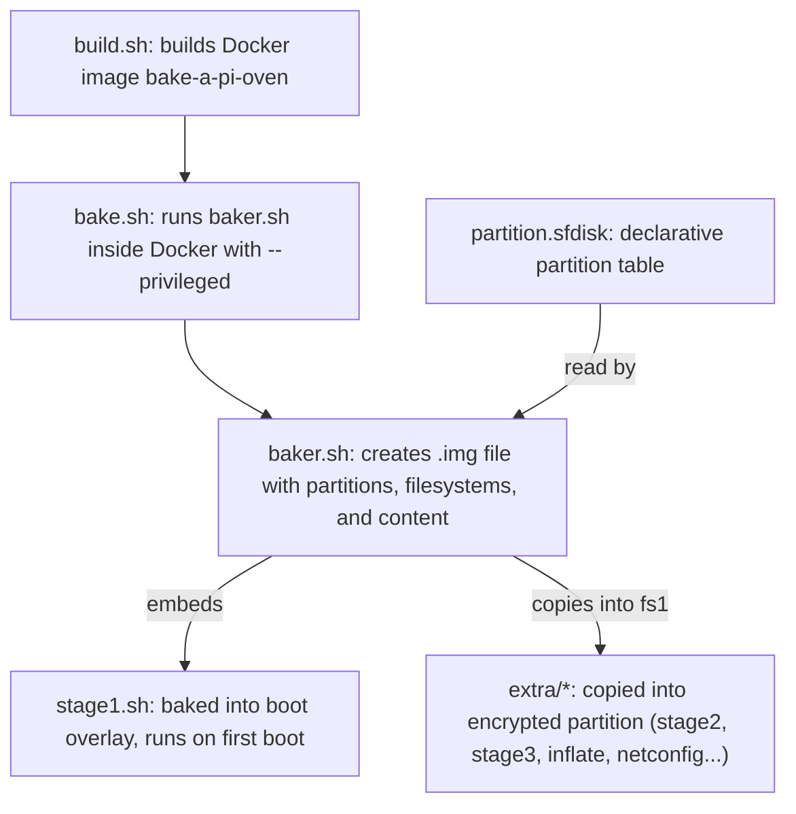
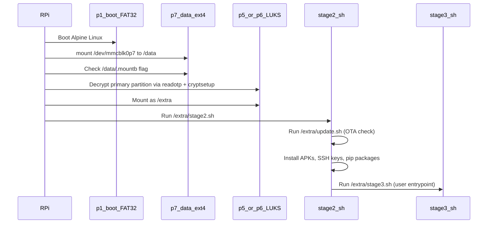

# Increase /data partition size

## Background: storage concepts for the uninitiated

### Filesystems, mounting, and drivers

A **filesystem** is a data structure that organizes bytes on a storage device into files and directories. Without a filesystem, a partition is just a flat sequence of bytes with no concept of "files."

**Yes, there can be multiple filesystems on one machine** -- your RPi already has several (FAT32 on the boot partition, ext4 on /data, ext4-inside-LUKS on /extra). Each one is an independent tree of files.

**Mounting** is how Linux makes a filesystem accessible. A filesystem lives on a block device (like `/dev/mmcblk0p7`), and `mount` attaches it to a directory (the "mount point") so you can `cd` into it and read/write files. `umount` detaches it. You can mount and unmount at will -- the data stays on the device, you're just connecting/disconnecting the directory view.

```
mount /dev/mmcblk0p7 /data      # now /data/foo.txt reads from p7
umount /data                     # /data is now empty again; p7 data is intact
```

Common filesystem types relevant here:

- **FAT32** (vfat) -- simple, no permissions, no journaling. Used for boot partitions because the RPi bootloader only understands FAT. Created with `mkfs.vfat`.
- **ext4** -- the standard Linux filesystem. Supports permissions, journaling, large files. Created with `mkfs.ext4`. Resizable with `resize2fs`.
- **tmpfs** -- lives entirely in RAM, vanishes on reboot. That's why `df -h` shows `tmpfs` entries with no block device.
- **squashfs** -- read-only compressed filesystem, used for Alpine's `.modloop` (the `loop0` and `loop1` entries in your `df` output).

**Drivers**: yes, the kernel needs filesystem drivers. On Linux they're kernel modules (or built-in). Alpine Linux ships with FAT, ext4, squashfs support out of the box. You don't need to install anything extra for the filesystems used in this project. Exotic filesystems (NTFS, ZFS, btrfs) would require installing additional kernel modules.

### Decrypting a partition before mounting it

LUKS (Linux Unified Key Setup) is an encryption layer that sits between the raw partition and the filesystem. The partition contains ciphertext -- meaningless bytes without the key. The flow is:

1. The raw partition (`/dev/mmcblk0p5`) contains the LUKS header + encrypted data
2. `cryptsetup luksOpen /dev/mmcblk0p5 extra` decrypts it and exposes a virtual block device at `/dev/mapper/extra`
3. Now `/dev/mapper/extra` behaves like a normal partition with an ext4 filesystem
4. `mount /dev/mapper/extra /extra` mounts the decrypted filesystem

```
/dev/mmcblk0p5          (raw ciphertext, type=da, can't mount directly)
       |
       v  cryptsetup luksOpen (requires passphrase/key)
       |
/dev/mapper/extra       (decrypted block device, contains ext4)
       |
       v  mount -t ext4
       |
/extra                  (usable directory tree)
```

To tear down: `umount /extra`, then `cryptsetup luksClose extra`. In baker.sh, `cryptsetup luksFormat` initializes a fresh LUKS container, and `mkfs.ext4` creates the filesystem inside it.

### MBR partition table and Extended Boot Records (EBRs)

The **MBR** (Master Boot Record) is the first 512 bytes of a disk. It contains:

- Boot code (446 bytes) -- executed by BIOS to start the OS
- Partition table (64 bytes) -- four 16-byte entries, so MBR supports at most **4 primary partitions**
- Boot signature (2 bytes) -- `55 AA`

To work around the 4-partition limit, one primary slot can be an **Extended partition** (type=5). This is a container that holds **logical partitions** chained via **EBRs** (Extended Boot Records). Each EBR is a 512-byte structure with the same layout as the MBR:

- Entry 1: describes the current logical partition (type, LBA offset relative to this EBR, size)
- Entry 2: pointer to the next EBR (type=05, LBA relative to start of extended partition)
- Entries 3-4: unused (all zeros)
- Boot signature: `55 AA`

This forms a linked list:

```
EBR #1 (sector 1050624)        EBR #2 (sector 5246976)        EBR #3 (sector 9443328)
  Entry1: p5 at +2048            Entry1: p6 at +2048            Entry1: p7 at +2048
  Entry2: next -> EBR#2          Entry2: next -> EBR#3          Entry2: null (end of chain)
```

### 1 MiB alignment and why it matters

Each logical partition starts 2048 sectors (1 MiB) after its EBR, even though the EBR itself is only 1 sector. The remaining 2047 sectors are alignment padding. This matters because:

- **Flash storage** (SD cards, eMMC, SSDs) erases data in large blocks (128 KiB - 4 MiB). If a partition starts mid-erase-block, every write straddles two blocks, roughly halving performance.
- **1 MiB** is the universal safe alignment (divisible by every common erase block size). All modern tools (`sfdisk`, `fdisk`, `parted`) default to it.
- This is also why img1 starts at sector 2048 (not sector 1) -- the first 1 MiB of the disk is reserved for the MBR + alignment.

### MBR partition type codes

The type byte in each partition entry is a single-byte advisory code. It doesn't enforce anything -- the kernel doesn't check it when mounting. But tools use it to decide how to handle the partition. The codes used in this project:

- `**b**` -- W95 FAT32. Signals a FAT32 filesystem. Used for the boot partition because the RPi bootloader only understands FAT.
- `**5**` -- Extended partition. Not a real data partition -- it's the container for logical partitions (the EBR chain). No filesystem lives here.
- `**da**` -- Non-FS data. Signals "don't try to auto-mount this." Used for LUKS-encrypted partitions where the raw bytes are ciphertext, not a filesystem. You must `cryptsetup luksOpen` first.
- `**83**` -- Linux native. The standard code for any Linux filesystem (ext4, xfs, btrfs, etc.). Used for `/data` -- a plain, unencrypted ext4 partition.

Baker.sh uses these type codes in its `case` statement (line 58) to decide whether to `mkfs.vfat`, `cryptsetup luksFormat` + `mkfs.ext4`, or plain `mkfs.ext4` for each partition.

### Reading raw bytes with dd + hexdump

`dd` copies raw bytes. `hexdump -C` renders them in a human-readable hex + ASCII grid. For example, to read the first EBR:

```
dd if=/dev/mmcblk0 bs=512 skip=1050624 count=1 | hexdump -C
```

- `bs=512` -- read in 512-byte blocks (one sector)
- `skip=1050624` -- skip to sector 1050624 (start of extended partition, where EBR #1 lives)
- `count=1` -- read exactly 1 sector

The hexdump output uses this format:

```
OFFSET    HEX BYTES (16 per line)                             ASCII
000001b0  00 00 00 00 00 00 00 00  00 00 00 00 00 00 00 86  |................|
          ^                                              ^
          offset 0x1B0                            offset 0x1BF
```

To decode a partition entry (16 bytes starting at 0x1BE):

- Byte 0: boot flag (0x00=no, 0x80=yes)
- Bytes 1-3: CHS address (legacy, ignored on modern systems)
- Byte 4: partition type code
- Bytes 5-7: CHS end address (legacy)
- Bytes 8-11: LBA start, **little-endian** (least significant byte first: `00 08 00 00` = 0x00000800 = 2048)
- Bytes 12-15: size in sectors, **little-endian** (`00 00 40 00` = 0x00400000 = 4194304)

### Device nodes: what they are, why they can vanish, and mdev

In Linux, hardware (disks, partitions, USB devices, etc.) is exposed to userspace as **device nodes** -- special files in `/dev/`. For example:

- `/dev/mmcblk0` -- the whole SD card
- `/dev/mmcblk0p1` through `/dev/mmcblk0p7` -- individual partitions
- `/dev/loop0` -- a loop device
- `/dev/mapper/extra` -- a decrypted LUKS volume

These are not regular files. They're kernel interfaces: when you read/write `/dev/mmcblk0p7`, the kernel translates that into I/O to the physical storage. Each device node has a **major** and **minor** number that tells the kernel which driver and which specific device to talk to. You can see them with `ls -l /dev/mmcblk0*`.

**Why they can vanish**: when the kernel re-enumerates partitions (e.g., after `partx -u` or `partprobe` updates the partition table), it may destroy and recreate its internal partition objects. The device nodes in `/dev/` are created by a userspace daemon that listens for kernel events:

- **udev** -- the standard device manager on most Linux distros (Debian, Ubuntu, Fedora)
- **mdev** -- the lightweight BusyBox alternative, used by Alpine Linux

If `mdev` isn't running as a daemon (Alpine doesn't always run it persistently), it won't hear the kernel's "partition changed" event, and the device node won't be recreated. Fix: run `mdev -s` to force a full rescan of all devices and recreate missing nodes:

```
mdev -s                          # rescan all devices, recreate /dev/ nodes
ls /dev/mmcblk0*                 # verify nodes are back
```

You can also manually create a device node with `mknod`, but `mdev -s` is simpler and covers everything.

**Useful commands for inspecting device nodes:**

- `ls -l /dev/mmcblk0*` -- list nodes with major/minor numbers
- `lsblk` -- tree view of block devices and their mount points
- `cat /sys/block/mmcblk0/mmcblk0p7/size` -- kernel's view of partition size (in 512-byte sectors), useful to verify if `partx`/`partprobe` actually updated the kernel
- `cat /proc/partitions` -- all partitions the kernel knows about

### Filesystem consistency checks with e2fsck

**e2fsck** (or **fsck.ext4**) checks and repairs ext4 filesystems. It verifies the internal data structures (superblock, block groups, inode tables, directory entries, etc.) for consistency.

**When it's needed:**

- `resize2fs` may require a clean filesystem check before expanding -- it refuses to resize if the filesystem might be inconsistent
- After an unclean shutdown (power loss), the journal usually handles recovery automatically, but a manual `e2fsck` can catch deeper issues
- As a periodic maintenance step (rarely needed in practice)

**Usage:**

```
e2fsck -f /dev/mmcblk0p7         # -f forces check even if filesystem appears clean
```

The `-f` flag is important because `e2fsck` normally skips the check if the filesystem's "clean" flag is set. `resize2fs` specifically asks for `-f` to ensure no latent issues before modifying structures.

**Critical rule**: never run `e2fsck` on a mounted filesystem. Always `umount` first. Running it on a mounted filesystem can cause data corruption.

In the inflate flow, the full sequence for expanding /data becomes:

```
umount /data
sfdisk -N 2 ...                  # expand extended partition
sfdisk -N 7 ...                  # expand /data partition
partx -u --nr 2,7 /dev/mmcblk0  # update kernel's partition view
mdev -s                          # recreate device nodes if missing
e2fsck -f /dev/mmcblk0p7        # check filesystem before resize
resize2fs /dev/mmcblk0p7        # grow ext4 to fill partition
mount /dev/mmcblk0p7 /data
```

### Raw storage without a filesystem

A partition (or a whole disk) without a filesystem is just a sequence of bytes. You **can** read from and write to it directly -- this is called "raw" or "block-level" access:

- `**dd**` -- the main tool. Copy bytes from one place to another. Examples:
  - `dd if=/dev/zero of=/dev/mmcblk0p7 bs=1M count=100` -- write 100 MiB of zeros to p7
  - `dd if=/dev/mmcblk0p5 of=backup.bin bs=1M` -- dump entire partition to a file
  - `dd if=image.img of=/dev/mmcblk0 bs=4M` -- flash a whole disk image onto an SD card
- `**hexdump**` / `**xxd**` -- inspect raw bytes: `hexdump -C /dev/mmcblk0p7 | head`
- `**losetup**` -- make a file pretend to be a block device (this is how baker.sh works: the `.img` file is a fake disk, and `losetup` carves out regions of it as virtual partitions)

This is exactly what the OTA update system does: `dd if=update.img of=/dev/mmcblk0p6 bs=100M` writes the encrypted partition image as raw bytes, completely overwriting whatever was there. No filesystem needed for this operation -- it's byte-for-byte copying.

Other use cases for raw partitions: swap space (`mkswap` + `swapon`), LUKS encryption containers (LUKS header + encrypted bytes, no filesystem until you decrypt and `mkfs` inside), database engines that want raw I/O.

### How to check your SD card size

SSH into the RPi and run:

```
fdisk -l /dev/mmcblk0
```

This shows the total disk size and all partitions. Look for the line like:

```
Disk /dev/mmcblk0: 14.84 GiB, 15931539456 bytes, 31116288 sectors
```

That first number is your total SD card capacity. Alternatively:

```
cat /sys/block/mmcblk0/size
```

This returns the total number of 512-byte sectors. Multiply by 512 to get bytes, or divide by 2097152 to get GiB.

For a quick human-readable check:

```
lsblk
```

Shows all block devices and their sizes in a tree view. The `mmcblk0` entry is your SD card, and `mmcblk0p1` through `mmcblk0p7` are the partitions.

**For planning purposes**: the new image will be ~6.56 GiB. Any SD card 8 GB or larger will work. If your SD cards are 8 GB, you'll have ~1.4 GB of slack after the image. If they're 16 GB or 32 GB, there's abundant room.

---

## How the partitioning scheme works end-to-end

### The build pipeline




### Partition layout (MBR / DOS label)

All values from [partition.sfdisk](bake-a-pi/tweaks/partition.sfdisk), sector size = 512 bytes:

- **img1** (p1) -- start=2048, size=1048576 (512 MiB), type=b (FAT32) -- **Boot partition**
- **img2** (p2) -- start=1050624, size=9448128 (~4.5 GiB), type=5 -- **Extended partition** (container only, no filesystem)
  - **img5** (p5) -- start=1052672, size=4194304 (2 GiB), type=da (LUKS) -- **Encrypted ext4 slot A** (`/extra`)
  - **img6** (p6) -- start=5249024, size=4194304 (2 GiB), type=da (LUKS) -- **Encrypted ext4 slot B** (`/extra` fallback)
  - **img7** (p7) -- start=9445376, size=1048576 (512 MiB), type=83 (Linux) -- **Plain ext4** (`/data`)

Total image size: ~5.05 GiB (dynamically computed in baker.sh as `STARTSECTOR_of_last + SIZE_of_last + 100000` sectors).

### Boot sequence on the RPi




### Linux commands and primitives used


| Primitive               | Where used                          | Purpose                                                             |
| ----------------------- | ----------------------------------- | ------------------------------------------------------------------- |
| `sfdisk`                | baker.sh line 38                    | Apply partition table from `.sfdisk` file to disk image             |
| `losetup`               | baker.sh lines 51, 60, 67, 76       | Attach regions of the .img file as loop devices (one per partition) |
| `mkfs.vfat`             | baker.sh line 62                    | Create FAT32 filesystem on boot partition                           |
| `mkfs.ext4`             | baker.sh lines 71, 78               | Create ext4 filesystems on encrypted and plain partitions           |
| `cryptsetup luksFormat` | baker.sh line 69                    | Initialize LUKS encryption on a partition                           |
| `cryptsetup luksOpen`   | baker.sh line 70, stage1.sh line 54 | Decrypt and expose a LUKS partition as `/dev/mapper/*`              |
| `dd`                    | baker.sh lines 35, 91, 227          | Create blank image, write MBR, extract update image                 |
| `mount` / `umount`      | baker.sh, stage1.sh                 | Mount/unmount filesystems                                           |
| `resize2fs`             | inflate.sh line 9                   | Grow an ext4 filesystem to fill its partition                       |
| `sfdisk -N`             | inflate.sh lines 7-8                | Resize a single partition in-place on a live disk                   |


### Directory hierarchy: /data and /extra

```
/data  (p7, plain ext4, 512 MiB, unencrypted)
  .mountb              -- flag: if present, boot from p6 instead of p5
  .update/             -- OTA update staging directory
    update.tar.gz      -- uploaded update archive
    signature           -- SHA1 checksum of archive
  update.log           -- log written by update.sh and stage1.sh

/extra  (p5 or p6, LUKS-encrypted ext4, 2 GiB)
  apks/<arch>/         -- pre-fetched Alpine APK packages + APKINDEX
  system/
    vendor.rsa.pub     -- vendor public key for signature verification
    authorized_keys    -- SSH authorized_keys for root
    passwd             -- /etc/passwd with root password hash
    shadow             -- /etc/shadow with root password hash
  wheels/              -- pre-built Python wheels + requirements.txt
  sshd_keys/           -- SSH host keys (created on first boot, persisted)
  netconfig/           -- network configuration scripts and defaults
    netconfig.py
    netconfig.default.yml
    reset_networking.py
    settings.py
    update_network_conf.py
  stage2.sh            -- second-stage boot script
  stage3.sh            -- user entrypoint (nginx example)
  update.sh            -- OTA update logic
  inflate.sh           -- disk expansion utility (never auto-called)
```

**Key distinction**: `/data` is unencrypted and used for mutable runtime state (update staging, boot flags, logs). `/extra` is encrypted, contains the OS configuration, secrets, and application code. The A/B scheme (p5/p6) allows safe OTA updates: write new image to the inactive slot, flip the `.mountb` flag, reboot.

### About inflate.sh

[inflate.sh](bake-a-pi/tweaks/extra/inflate.sh) is a **manual utility** -- it is never called from any script. It is copied to `/extra/` but sits dormant. Its intent is to expand partitions at runtime when the image has been flashed onto an SD card larger than the image itself.

However, **it appears to have a bug**:

- Line 7: `sfdisk -N 2` -- correctly expands the extended partition (p2) to fill remaining SD card space
- Line 8: `sfdisk -N 5` -- expands p5 (first encrypted slot), but this is almost certainly wrong; p6 and p7 sit right after p5, so there is no free space to grow into
- Line 9: `resize2fs /dev/mmcblk0p7` -- resizes the /data filesystem, but since the p7 partition was never expanded, this is a no-op

The correct version should probably expand p7 (not p5), i.e., line 8 should be `sfdisk -N 7`.

### Wiggle room analysis

The image is dynamically sized from partition.sfdisk. The only hard constraint is that the total image must fit on the target SD card. Current image: ~5.05 GiB. Typical SD cards are 8, 16, or 32 GiB -- so there is plenty of room.

Within the image, space can be redistributed freely by editing `partition.sfdisk`. The only "dependencies" are:

- p5 and p6 must be the same size (they are A/B mirrors for OTA updates; the update image is `dd`-ed onto the inactive slot as a raw block copy -- see [update.sh](bake-a-pi/tweaks/extra/update.sh) line 88)
- p7 must start after p6 ends
- The extended partition (p2) must contain all logical partitions (p5, p6, p7)

There is no code anywhere that hardcodes partition sizes or start offsets -- baker.sh reads everything dynamically from partition.sfdisk.
